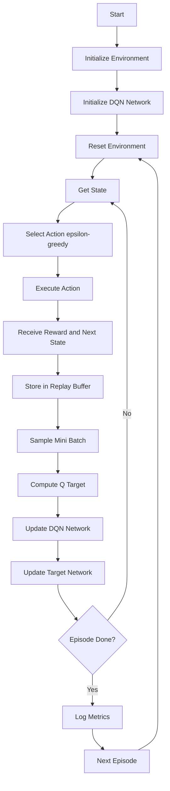
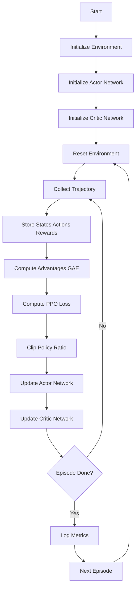

# Battery-Aware Mars Rover Navigation using DQN vs PPO

# Repository Structure

```
Battery-Aware-Mars-Rover-DQN-vs-PPO/
│
├── rover_env.py                # Battery-aware Mars environment
├── dqn_agent.py                # DQN implementation
├── ppo_agent.py                # PPO implementation
├── train_dqn.py                # DQN training script
├── train_ppo.py                # PPO training script
│
├── dqn_results.pkl             # DQN training metrics
├── ppo_results.pkl             # PPO training metrics
│
├── compare_reward.png
├── compare_steps.png
├── compare_success_rate.png
├── compare_battery.png
├── compare_budget_margin.png
├── DQN_vs_PPO_Overlapping.png
│
├── Battery_Aware_Rover.png     # environment visualization
├── PPO_Training_Results.png
│
├── DQN_PPO_Agents.ipynb        # full notebook
└── README.md
```

## Overview

This project implements a **battery-aware autonomous Mars rover navigation system** using **Deep Reinforcement Learning**. The rover must reach a goal location in a grid-based Martian terrain while **optimizing battery consumption**, **avoiding obstacles**, and **handling difficult terrain** such as sand and rocks.

Two reinforcement learning algorithms are compared:

* Deep Q-Network (DQN)
* Proximal Policy Optimization (PPO)

The objective is to evaluate which algorithm performs better in **battery-aware autonomous navigation**.

---

# Problem Statement

Autonomous planetary rovers operate in harsh environments with:

* Limited battery capacity
* Unknown terrain difficulty
* Obstacles blocking shortest paths
* Energy-consuming terrain (sand, rocks)
* Need for efficient navigation

Traditional path planning methods like A* do not consider **battery-aware learning behavior** in dynamic environments.

### Goal

Train a reinforcement learning rover that:

* Reaches destination successfully
* Minimizes battery consumption
* Avoids obstacles
* Learns terrain-aware routing
* Maximizes reward

---

# Solution Approach

We compare two RL agents:

### DQN Agent

* Value-based method
* Learns Q-values
* Uses replay buffer
* ε-greedy exploration
* Stable but slower learning

### PPO Agent

* Policy-gradient method
* Actor-Critic architecture
* Clipped objective
* More stable updates
* Better exploration

---


# Environment Description

Grid-based Mars terrain contains:

| Terrain Type | Value | Energy Cost |
| ------------ | ----- | ----------- |
| Normal       | 0     | 1           |
| Sand         | 1     | 3           |
| Rock         | 2     | 5           |
| Obstacle     | 3     | Blocked     |

State includes:

* Rover X position
* Rover Y position
* Remaining battery
* Distance to goal
* Local terrain info
* Budget margin
* Battery percentage

---


# DQN Solution Flowchart

---

# PPO Solution Flowchart



---

# Reward Design

The rover receives:

### Positive Rewards

* Reaching goal
* Efficient battery usage
* Moving toward goal

### Negative Rewards

* Collision with obstacle
* Battery depletion
* Moving away from goal
* High terrain energy cost

---


---

# Training Metrics Compared

The following metrics are evaluated:

* Total Reward
* Success Rate
* Battery Remaining
* Steps Taken
* Budget Margin
* Convergence Speed

---

# Results Summary

PPO typically shows:

* Faster convergence
* Higher success rate
* Better battery management
* Smoother policy learning

DQN typically shows:

* Stable learning
* Slower convergence
* Slightly lower exploration

---

# How to Run

### Train DQN

```
python train_dqn.py
```

### Train PPO

```
python train_ppo.py
```

### Compare Results

Run comparison notebook or plotting script.

---

# Visualization Outputs

The repository generates:

* Reward comparison graph
* Battery usage comparison
* Success rate comparison
* Steps comparison
* PPO vs DQN overlapping curves
* Terrain visualization

---

# Applications

* Mars rover navigation
* Lunar rover autonomy
* Underwater robot navigation
* Battery-aware robotics
* Autonomous exploration vehicles

---

# Future Work

* Add continuous action space
* Add SLAM integration
* Multi-goal navigation
* Real Mars terrain dataset
* Multi-agent rover coordination

---
